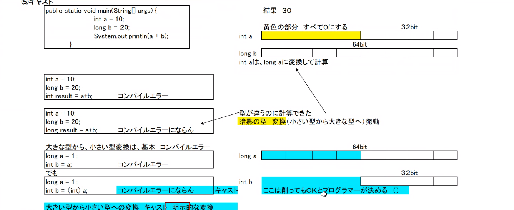

# 変数
1. 変数の宣言と初期化
    > 型名 変数;  
    変数 = 値;

    もし変数を宣言する時点で代入する
    > 変数 変数名 = 値;
    - <font color="red">注意点</font>
        > 変数を使うときは必ず初期化する

    ⇓⇓⇓例⇓⇓⇓
    ```java
    int num;
    num = 10;
    ```
    - int num;

        変数の宣言
        
            > メモリ上で今からこの変数がどのくらいのメモリ範囲を使うかの宣言

    - num = 10;

        変数の初期化

            > 最初に変な数字が入っていた場合の処理

    - <font color="red">注意点</font>
    > finalをつけつと描き替えれない変数になる
    ```java
    final int num = 10;
    num = 20; // ここでコンパイルエラーになる
    ```
---
---

2. 変数

    | 種類       | 型      | ビット数 | 値                                       | 
    | :--------: | :-----: | :------: | :--------------------------------------: | 
    | 真偽地     | boolean | 1        | TrueまたはFalse                          | 
    | 文字       | char    | 16       | Unicodeコード                            | 
    | 整数       | byte    | 8        | -128~127                                 | 
    | 整数       | short   | 18       | -32768~32767                             | 
    | 整数       | int     | 32       | -2147483648~2147483647 　　　   　　　    | 
    | 整数       | long    | 64       | -9223372036854775808~9223372036854775807 | 
    | 浮動小数点 | float   | 32       | 単精度浮動小数点                         | 
    | 整数       | double  | 64       | 倍精度浮動小数点                         | 
---
---
3. 算術演算子
    | 演算子 | 使用例 | 意味             | 
    | ------ | ------ | ---------------- | 
    | +      | a + b  | aにbを加える     | 
    | -      | a - b  | aからbを引く     | 
    | *      | a * b  | aかけるb         | 
    | /      | a / b  | a割るb           | 
    | %      | a % b  | aをbで割った余り 

    - <font color="red">注意点</font>
        > 演算子は文字列連結にも使う  
        左から順番に連結される

    - 算術演算子は文字列の連結にも使用する
    ```java
    String fast = "hello ";
    String last = "world";
    System.out.println(fast + last + "!");
    ```
    - <font color="red">注意点！！！</font>
    > 最初から計算していく上で最初が数字＋文字だとその後も文字として計算される

    ⇓⇓⇓例⇓⇓⇓
    ```java
    String dol = "$";
    System.out.println(dol + 10 + 10);
    // 結果は「$1010」となる

    String yen = "y";
    System.out.println(10 + 10 + yen);
    // 結果は「20y」となる
    ```
---
---
4. インクリメント(++)とデクリメント(--)
    - インクリメント
        > 前置き: ++変数  
        後置き: 変数++
    - デクリメント
        > 前置き: --変数  
        後置き: 変数--
    - <font color="red">注意点</font>
        > 前置き、後置きで、変数に1増価させたり減少させたりする事に変わりがないが、単純な増加現象以外の場合に違いが出てくる
    
    - 前置きの場合
        ```java
        a = 0;
        b = ++a;
        ```
        上の場合aが先に増加してbにaが代入する
    - 後置きの場合
        ```java
        a = 0;
        b = a++;
        ```
        上の場合bにaが代入したのちにaが増加する


5. cast
> 型を変換するやつ
- upcast
    > 小さいほうから大きいほうに変換する(int to long)
    ### 例
    > 2つブロックがありintのブロックにもう一つ0で埋まったブロックを挿入  
    挿入するブロックは全部0なので大きな違いはない
- downcast
    > 大きいほうから小さいほうに変換する(long to int)
    ### 例
    > 二つのブロックを使われており、左のブロックを削除する。そのため、先頭の文字も消えるため、+-が変わる場合がある。また数字も変わる場合がある。


---
---

6. if
    1. 基本型
    > if(条件式){  
        処理内容  
    }

    2. 分岐を増やす
    > if (条件式){  
        処理内容  
    }else{  
        条件式に満たさない場合の処理  
    }  
    if (条件式){  
        処理内容  
    } else if(条件式){  
        他の処理内容  
    } else {  
    }
---
---
7. 論理演算子

|        |            |          | 
| :----: | :--------: | :------: | 
| 否定   | !A         | Aの否定  | 
| 論理和 | A & B      | AかつB   | 
| 論理積 | A &#124; B | AまたはB | 


### A & B
| A     | B     | A & B | 
| :---: | :---: | :---: | 
| true  | true  | true  | 
| true  | false | false | 
| false | true  | false | 
| false | false | false | 

### A | B
| A     | B     | A & B | 
| :---: | :---: | :---: | 
| true  | true  | true  | 
| true  | false | true  | 
| false | true  | true  | 
| false | false | false | 

- ショートサーキット演算子

    左辺の四季の結果によって右辺を実行するか変える
    > AND演算 &&で表現し、左辺がFalseなら、右辺は演算省略  
    > OR演算　||で表現し、左辺がTrueなら、右辺は演算省略
---
---
---

