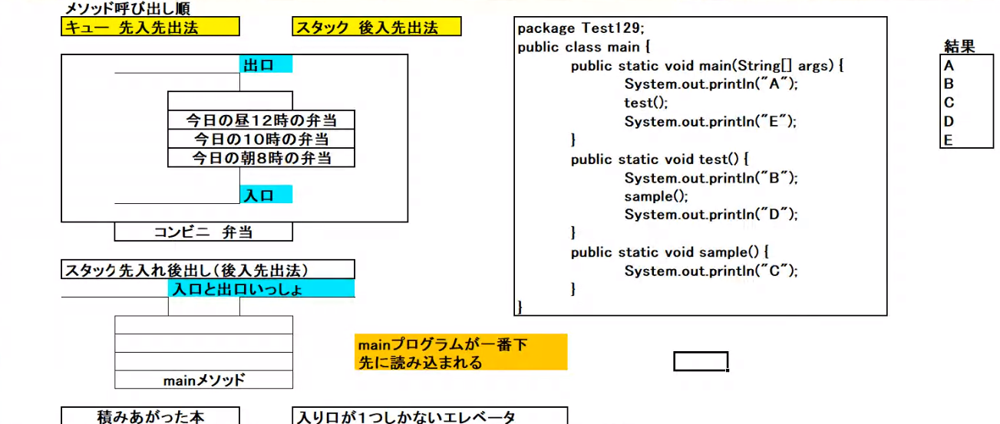

# 配列と関数

1. 配列
> 配列は、複数の値を添える　同じ型　添え字でアクセス
- <font color="red">注意点</font>  
    添え字は0から

    ### 配列の意義
    > javaの本が3冊あるとするとき、タイトル名を言われて取るのと、番号を言ってもらうののどちらが簡単かという感じで、指示するほうも支持しやすくなる


    - 配列の宣言
    ```java
    int[] array;
    int array[];
    ```

    - 配列作成
    ```java
    int[] array = new int[3];
    // 3は要素数で、変えることはできない
    ```

    - 初期化
    ```java
    int[] array = new int[3];
    array[0] = 10;
    array[1] = 20;
    array[2] = 30;

    for (int i = 0; i < 3; i ++){
        int val = array[i];
        System.out.println(val);
    }

    // 結果
    // 
    // 10
    // 20
    // 30
    ```

    - 初期化し
    上記は配列が大きくなると面倒＞初期化
    ```java
    int[] array = {10, 20, 30};
    ```
    > 必ず変数宣言と同時に使う

    配列の大きさは、一番初めに決まっていて、それを超えるとエラーが出る
    - 初期化
    ```java
    int[] array = new int[3];
    array[0] = 10;
    array[1] = 20;
    array[2] = 30;

    for (int i = 0; i < 4; i ++){
        int val = array[i];
        System.out.println(val);
    }

    // 結果
    // 
    // 10
    // 20
    // 30
    // java.lang.ArrayIndexOutOfrange
    ```
    <font color="red">array.lengthは、配列の長さ</font>

    ```java
    int[] array = new int[3];
    array[0] = 10;
    array[1] = 20;
    array[2] = 30;

    for (int i = 0; i < array.length; i ++){
        int val = array[i];
        System.out.println(val);
    }

    // 結果
    // 
    // 10
    // 20
    // 30
    ``` 
2. 拡張for文
> 多言語でいうfor each文  
拡張for文　集合から1つずつ値を取り出し、すべて取り出したら終了する

```java
for(データ型 変数名: 集合){
    // 繰り返す処理
}
```
<font color="red">:の左側は、一時的変数右は配列</font>

```java
int[] array = {10, 20, 30};
for (int val: array){
    System.out.println(val);
}
```

<font color="orange">最初から最後まで、すべての値を1つずつ取り出す</font>

3. メソッド
> メソッド　関数　一連の流れ　ブロックで説明

プログラムの実行準　mainメソッド  

<font color="orange">定義した順位関係なく、mainメソッドから始まり、mainメソッドから呼び出されないメソッドは実行されない</font>

```java
public static void main(Strings[] args){
    System.out.println("A");
}
public static void sample(){
    System.out.println("B");
}

// 結果
// A
```
反対の場合
```java
public static void main(Strings[] args){
    System.out.println("B");
}
public static void main(Strings[] args){
    System.out.println("A");
}
// 結果
// B
```
エントリーポイント　プログラムの開始場所がない場合  
<font color="red">実行できない</font>

```java
public static void test(){
    Ststem.out.println("test");
}
public static void sample(){
    System.out.println("sample");
}
// どちらもmain(Strings[] args)　がない場合、実行できない
```
<font color="orange">メソッドの呼び出し  
メソッド名</font>

```java
public static void sample(){
    System.out.println("B");
}
public static void main(String[] args){
    System.out.println("A");
    sample();
}

// 結果
// A
// B
```
連続呼び出し

```java
public static void main(String[] args){
    System.out.println("a");
    test();
}
public static void test(){
    System.out.println("b");
    sample();
}
public static void sample(){
    System.out.println("c");
}

// 結果
// a
// b
// c
```

メソッドの呼び出し準
- キュー　先入れ先出し法
- スタック　後入れ後出し法


```java
public static void main(String[] args){
    System.out.println("a");
    test();
    System.out.println("e");
}
public static void test(){
    System.out.println("b");
    sample();
    Sysem.out.println("e");
}
public static void sample(){
    System.out.println("c");
}

// 結果
// a
// b
// c
// d
// e
```
<font color="orange">後入れ先出し法のようにmainのプログラムが先に読まれる</font>
---
参考  
<font color="orange">１つのメソッドに同じ名前の変数　複数宣言するとコンパイルエラー</font>

```java
public static void main(String[] args){
    int a = 10;
    int a = 20;
}
public static void test(){
    int a = 20;
}
// エラーになる
```

```java
public static void main(String[] args){
    int a = 10;
}
public static void test(){
    int a = 20;
}
// エラーにならない
```
