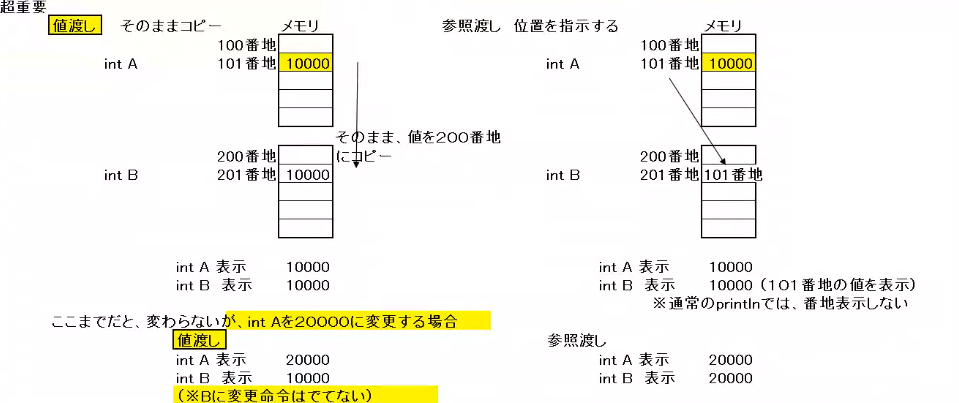

# 引数と戻り値

<font color="red">重要</font>

- 値渡し
> 値をそのまま渡す

- 参照渡し
> 値の場所を渡す



int B を50000にしたとき
> 渡し  
int A 20000  
int B 50000  
参照渡し  
int A 50000  
int B 50000  

```java
package Test12;							
							
public class main {							
							
	public static void main(String[] args) {						
		int a = 10;					
		multiParameterMethod(a, 20);					
	}						
	public static void multiParameterMethod(int a, int b) {						
		System.out.println(a * b);					
							
							
	}						
							
}	
```

# 戻り値
> returnを使う  
voidは戻り値お戻さない

メソッドの定義と呼びだす側で、戻り値と肩を一致させる必要がある。
```java

public static void main(String[] args){
    int val = returnableValue();
    System.out.println(val);
}
public static int returnableValue(){
    int tmp = 100;
    return tmp;
}

// 結果
// 100
```
<font color="orange">引数は複数オッケー、戻り値は1つ</font>